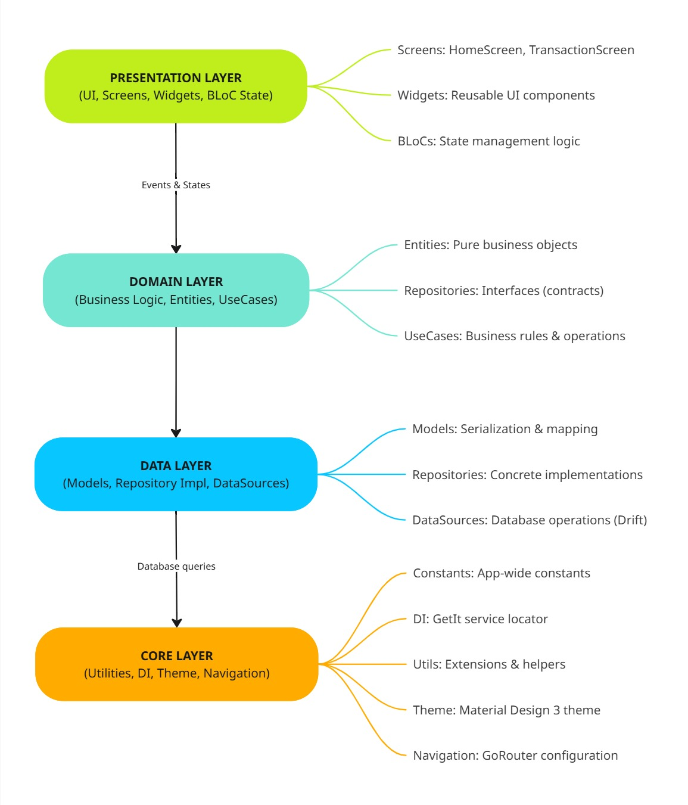

# Tài liệu Sản phẩm - Ứng dụng Quản lý Thu Chi

> **Phiên bản**: MVP1

> **Ngày cập nhật**: 12/01/2026
---

## Mục lục

1. [Tổng quan](#tổng-quan)
2. [Tính năng](#tính-năng)
3. [Kiến trúc hệ thống](#kiến-trúc-hệ-thống)
4. [Tech Stack](#tech-stack)
5. [Database](#database)
6. [Giao diện người dùng](#giao-diện-người-dùng)
7. [Data Flow](#data-flow)
8. [Roadmap](#roadmap)

---

## Tổng quan

### Giới thiệu

**Ứng dụng Quản lý Thu Chi** là một giải pháp mobile offline giúp người dùng Việt Nam quản lý tài chính cá nhân một cách đơn giản và hiệu quả. Ứng dụng được xây dựng trên nền tảng Flutter với kiến trúc Clean Architecture, đảm bảo khả năng mở rộng và bảo trì dễ dàng.

### Mục tiêu

- **Đơn giản hóa** việc theo dõi thu chi hàng ngày
- **Trực quan hóa** thói quen chi tiêu qua biểu đồ và báo cáo
- **Offline** hoạt động mượt mà không cần kết nối internet
- **Bảo mật** dữ liệu tài chính được lưu trữ local trên thiết bị

### Đối tượng người dùng

- Người dùng cá nhân muốn quản lý tài chính hàng ngày
- Sinh viên cần kiểm soát chi tiêu
- Freelancer theo dõi thu nhập và chi phí
- Gia đình quản lý ngân sách gia đình

---

## Tính năng

### Module 1: Quản lý Giao dịch (Hoàn thành)

#### 1.1. Thêm giao dịch mới
- **Chức năng**: Cho phép người dùng ghi nhận giao dịch thu hoặc chi
- **Input fields**:
  - Loại giao dịch: Thu nhập / Chi tiêu
  - Số tiền (VND) - validation: 0.01 đến 999,999,999,999.99
  - Danh mục (chọn từ 12 danh mục mặc định)
  - Mô tả (tùy chọn, max 500 ký tự)
  - Ngày giờ (mặc định là hiện tại)
- **Validation**:
  - Số tiền phải lớn hơn 0
  - Danh mục bắt buộc phải chọn
  - Ngày không được là tương lai

#### 1.2. Danh sách giao dịch
- **Hiển thị**: Danh sách giao dịch được nhóm theo ngày
- **Sắp xếp**: Mới nhất lên đầu (theo thời gian)
- **Thông tin hiển thị**:
  - Icon và màu sắc danh mục
  - Số tiền (format: #,### ₫)
  - Mô tả giao dịch
  - Thời gian (Hôm nay, Hôm qua, dd/MM/yyyy)
- **Actions**: 
  - Xem chi tiết (tap vào item)
  - Chỉnh sửa (swipe action)
  - Xóa (swipe action với confirmation)

#### 1.3. Lọc và tìm kiếm
- **Lọc theo thời gian**:
  - Hôm nay
  - 7 ngày qua
  - Tháng này
  - Tháng trước
  - Tùy chỉnh khoảng thời gian
- **Lọc theo loại**: Thu nhập / Chi tiêu
- **Lọc theo danh mục**: Multi-select categories
- **Tìm kiếm**: Search by description

#### 1.4. Chỉnh sửa giao dịch
- **Chức năng**: Cập nhật thông tin giao dịch đã tồn tại
- **Fields**: Tương tự thêm giao dịch mới
- **Constraint**: Không cho phép thay đổi loại giao dịch (thu/chi)

#### 1.5. Xóa giao dịch
- **Confirmation dialog**: Yêu cầu xác nhận trước khi xóa
- **Soft delete**: Có thể implement undo trong tương lai
- **Impact**: Cập nhật lại số liệu thống kê

#### 1.6. Danh mục mặc định

**Danh mục Chi tiêu**:
1. Ăn uống - #FF6B6B
2. Đi lại - #4ECDC4
3. Mua sắm - #95E1D3
4. Giải trí - #F38181
5. Y tế - #AA96DA
6. Giáo dục - #FCBAD3
7. Hóa đơn - #FFFFD2
8. Khác - #A8DADC

**Danh mục Thu nhập**:
1. Lương - #06D6A0
2. Thưởng - #118AB2
3. Đầu tư - #073B4C
4. Thu nhập khác - #06D6A0

---

### Module 2: Phân tích Tài chính (Hoàn thành)

#### 2.1. Tổng quan tài chính
- **Tổng thu nhập** trong kỳ (màu xanh lá)
- **Tổng chi tiêu** trong kỳ (màu đỏ)
- **Số dư** = Thu nhập - Chi tiêu
- **Thay đổi** so với kỳ trước (% tăng/giảm)

#### 2.2. Biểu đồ phân tích chi tiêu (Pie Chart)
- **Mục đích**: Hiển thị tỷ lệ % chi tiêu theo từng danh mục
- **Thư viện**: fl_chart
- **Interaction**: 
  - Tap vào segment để xem chi tiết
  - Hiển thị số tiền và % của danh mục
- **Color coding**: Sử dụng màu sắc của từng danh mục
- **Empty state**: Hiển thị message khi chưa có dữ liệu

#### 2.3. Biểu đồ xu hướng (Line Chart)
- **Trục X**: Thời gian (ngày/tuần/tháng)
- **Trục Y**: Số tiền (VND)
- **2 đường line**:
  - Thu nhập (màu xanh lá)
  - Chi tiêu (màu đỏ)
- **Interaction**: 
  - Tap để xem giá trị tại điểm
  - Zoom và pan (nếu có nhiều data points)

#### 2.4. Top danh mục chi tiêu
- **Hiển thị**: Top 5 danh mục chi tiêu nhiều nhất
- **Thông tin**:
  - Icon và tên danh mục
  - Tổng chi tiêu
  - % so với tổng chi
  - Progress bar trực quan
- **Sorting**: Từ cao xuống thấp

#### 2.5. Báo cáo theo kỳ
- **Kỳ báo cáo**:
  - Hôm nay
  - Tuần này (Thứ 2 - Chủ nhật)
  - Tháng này
  - Năm này
  - Tùy chỉnh
- **Thông tin chi tiết**:
  - Tổng số giao dịch
  - Trung bình chi tiêu/ngày
  - Ngày chi tiêu nhiều nhất
  - Danh mục chi tiêu nhiều nhất

#### 2.6. So sánh kỳ
- **Tính năng**: So sánh kỳ hiện tại với kỳ trước
- **Metrics**:
  - Thu nhập: tăng/giảm X% (Y ₫)
  - Chi tiêu: tăng/giảm X% (Y ₫)
  - Số dư: tăng/giảm X% (Y ₫)
- **Visualization**: Icon mũi tên lên/xuống với màu sắc

---

### Module 3: Mục tiêu Tiết kiệm (Sắp triển khai)

#### 3.1. Tạo mục tiêu
- Tên mục tiêu
- Số tiền mục tiêu
- Thời hạn (ngày đích)
- Icon và màu sắc
- Mô tả

#### 3.2. Theo dõi tiến độ
- Progress bar
- Số tiền đã tiết kiệm / Mục tiêu
- % hoàn thành
- Thời gian còn lại
- Số tiền cần tiết kiệm/ngày

#### 3.3. Đóng góp vào mục tiêu
- Liên kết giao dịch với mục tiêu
- Tự động cập nhật tiến độ

---

### Module 4: Cảnh báo Chi tiêu (Sắp triển khai)

#### 4.1. Đặt ngân sách
- Ngân sách theo danh mục
- Ngân sách tổng
- Chu kỳ: Ngày/Tuần/Tháng/Năm

#### 4.2. Cảnh báo
- Cảnh báo khi đạt 80% ngân sách
- Cảnh báo khi vượt ngân sách
- Thông báo push (local notification)

#### 4.3. Giao dịch định kỳ
- Tự động tạo giao dịch lặp lại
- Frequency: Daily/Weekly/Monthly/Yearly
- Thông báo nhắc nhở

---

## Kiến trúc hệ thống

### Kiến trúc (4 Layers)



**Chi tiết các layer:**

- **Presentation Layer**: UI, Screens, Widgets, BLoC State
  - Screens: HomeScreen, TransactionScreen
  - Widgets: Reusable UI components
  - BLoCs: State management logic

- **Domain Layer**: Business Logic, Entities, UseCases
  - Entities: Pure business objects
  - Repositories: Interfaces (contracts)
  - UseCases: Business rules & operations

- **Data Layer**: Models, Repository Impl, DataSources
  - Models: Serialization & mapping
  - Repositories: Concrete implementations
  - DataSources: Database operations (Drift)

- **Core Layer**: Utilities, DI, Theme, Navigation
  - Constants: App-wide constants
  - DI: GetIt service locator
  - Utils: Extensions & helpers
  - Theme: Material Design 3 theme
  - Navigation: GoRouter configuration

### Dependency Rule

- **Presentation** phụ thuộc vào **Domain**
- **Data** phụ thuộc vào **Domain**
- **Domain** không phụ thuộc vào layer nào (pure business logic)
- **Core** được sử dụng bởi tất cả các layer

### Key Principles

1. **Separation of Concerns**: Mỗi layer có trách nhiệm rõ ràng
2. **Dependency Inversion**: High-level modules không phụ thuộc low-level
3. **Single Responsibility**: Mỗi class/module có 1 trách nhiệm duy nhất
4. **Testability**: Business logic có thể test độc lập với UI và database

---

## Tech Stack

### 1. Framework & Language

#### Flutter 3.10.4+
- **Cross-platform**: Build 1 codebase cho Android & iOS
- **Hot Reload**: Development nhanh chóng
- **Performance**: Gần native performance
- **Material Design 3**: Modern UI components

#### Dart 3.10.4+
- **Type-safe**: Strong typing với null safety
- **Async/Await**: Xử lý bất đồng bộ dễ dàng
- **Extension methods**: Mở rộng functionality
- **Sealed classes**: Pattern matching (Dart 3+)

---

### 2. State Management

#### BLoC Pattern (Business Logic Component)
- **Package**: flutter_bloc 8.1.6
- **Unidirectional data flow**: UI → Event → BLoC → State → UI
- **Separation**: UI logic tách biệt business logic
- **Testability**: Dễ dàng test state transitions

**Ví dụ Transaction BLoC**:
```
User Action (Add Transaction)
    ↓
Event: AddTransactionEvent
    ↓
BLoC: TransactionBloc
    ↓ (calls UseCase)
Domain: AddTransactionUseCase
    ↓ (calls Repository)
Data: TransactionRepositoryImpl
    ↓ (database operation)
State: TransactionAdded / TransactionError
    ↓
UI: Show success / error message
```

---

### 3. Navigation

#### GoRouter 14.6.2
- **Declarative routing**: Define routes in one place
- **Deep linking**: Support URL-based navigation
- **Type-safe**: Named routes with parameters
- **Error handling**: Custom error screens

**Routes**:
- `/` - Home screen
- `/transactions` - Transaction list
- `/transactions/add` - Add new transaction
- `/transactions/edit/:id` - Edit transaction
- `/analytics` - Analytics dashboard

---

### 4. Database

#### Drift 2.20.3
- **Type-safe queries**: Compile-time query validation
- **Code generation**: Auto-generate DAO code
- **Migrations**: Schema versioning support
- **Reactive**: Stream-based data observation
- **Performance**: Native SQLite performance

**Key Features**:
- Complex queries với Dart syntax
- Relationships và joins
- Transactions và batch operations
- Custom types và converters

#### SQLite3 Flutter Libs
- **Package**: sqlite3_flutter_libs 0.5.24
- **Purpose**: SQLite native bindings
- **Platform support**: Android, iOS, Linux, Windows

---

### 5. Error Handling

#### Dartz 0.10.1 (Functional Programming)
- **Either<Failure, Success>**: Elegant error handling
- **No try-catch spaghetti**: Pure functional approach
- **Chainable operations**: map, flatMap, fold

**Failure Hierarchy**:
```dart
abstract class Failure
  ├── DatabaseFailure (DB operations)
  ├── ValidationFailure (Input validation)
  ├── NotFoundFailure (Resource not found)
  ├── ServerFailure (API calls - future)
  └── UnknownFailure (Unexpected errors)
```

---

### 6. Data Visualization

#### FL Chart 0.69.2
- **Chart types**: Line, Bar, Pie, Scatter
- **Interactive**: Touch interactions
- **Customizable**: Colors, styles, animations
- **Performance**: Optimized for mobile

**Used Charts**:
- **Pie Chart**: Category breakdown (chi tiêu theo danh mục)
- **Line Chart**: Income/Expense trends (xu hướng thu chi)
- **Bar Chart**: Daily/Weekly summaries (future)

---

### 7. Localization & Formatting

#### Intl 0.20.1
- **Date formatting**: Vietnamese locale (dd/MM/yyyy)
- **Number formatting**: Currency (#,### ₫)
- **Relative dates**: "Hôm nay", "Hôm qua"

**Extensions**:
- `DateTimeExtensions`: toDateString(), isToday, startOfMonth, etc.
- `DoubleExtensions`: toCurrency(), toCompactCurrency(), toPercentage()
- `StringExtensions`: capitalize(), isNumeric, toDoubleOrZero()

---

### 8. Monitoring & Crashlytics

#### Firebase Crashlytics 4.1.5
- **Crash reporting**: Automatic crash detection
- **Error tracking**: Non-fatal errors logging
- **Stack traces**: Detailed crash information
- **User metrics**: Crash-free users percentage

---

### 9. UI/UX Design

#### Material Design 3
- **Theme**: Custom theme với primary color #6C63FF
- **Components**: Modern Material 3 widgets
- **Elevation**: Layered UI với shadows
- **Typography**: Consistent text styles

**Color Palette**:
- **Primary**: #6C63FF (Purple)
- **Accent**: #00D4AA (Teal)
- **Success**: #06D6A0 (Green) - Income
- **Error**: #EF476F (Red) - Expense
- **Warning**: #FFD166 (Yellow)
- **Info**: #118AB2 (Blue)

---

## Database

### Database Schema (Drift)

#### Table: categories
```sql
CREATE TABLE categories (id INTEGER PRIMARY KEY AUTOINCREMENT,
  name TEXT NOT NULL CHECK(length(name) >= 1 AND length(name) <= 100),
  icon TEXT NOT NULL,
  color TEXT NOT NULL,
  type TEXT NOT NULL CHECK(type IN ('income', 'expense')),
  is_default BOOLEAN NOT NULL DEFAULT FALSE,
  created_at DATETIME NOT NULL DEFAULT CURRENT_TIMESTAMP
);
```

**Indexes**: 
- `idx_categories_type` ON (type)

---

#### Table: transactions
```sql
CREATE TABLE transactions (id INTEGER PRIMARY KEY AUTOINCREMENT,
  amount REAL NOT NULL CHECK(amount > 0),
  description TEXT,
  date DATETIME NOT NULL,
  category_id INTEGER NOT NULL REFERENCES categories(id),
  type TEXT NOT NULL CHECK(type IN ('income', 'expense')),
  is_recurring BOOLEAN NOT NULL DEFAULT FALSE,
  recurring_transaction_id INTEGER REFERENCES recurring_transactions(id),
  created_at DATETIME NOT NULL DEFAULT CURRENT_TIMESTAMP,
  updated_at DATETIME NOT NULL DEFAULT CURRENT_TIMESTAMP
);
```

**Indexes**:
- `idx_transactions_date` ON (date DESC)
- `idx_transactions_category` ON (category_id)
- `idx_transactions_type` ON (type)

---

#### Table: recurring_transactions
```sql
CREATE TABLE recurring_transactions (id INTEGER PRIMARY KEY AUTOINCREMENT,
  amount REAL NOT NULL,
  description TEXT,
  category_id INTEGER NOT NULL REFERENCES categories(id),
  type TEXT NOT NULL,
  frequency TEXT NOT NULL CHECK(frequency IN ('daily', 'weekly', 'monthly', 'yearly')),
  start_date DATETIME NOT NULL,
  end_date DATETIME,
  next_occurrence DATETIME NOT NULL,
  is_active BOOLEAN NOT NULL DEFAULT TRUE,
  created_at DATETIME NOT NULL DEFAULT CURRENT_TIMESTAMP,
  updated_at DATETIME NOT NULL DEFAULT CURRENT_TIMESTAMP
);
```

---

#### Table: saving_goals
```sql
CREATE TABLE saving_goals (id INTEGER PRIMARY KEY AUTOINCREMENT,
  name TEXT NOT NULL CHECK(length(name) >= 1 AND length(name) <= 200),
  description TEXT,
  target_amount REAL NOT NULL,
  current_amount REAL NOT NULL DEFAULT 0,
  target_date DATETIME,
  icon TEXT,
  color TEXT,
  is_completed BOOLEAN NOT NULL DEFAULT FALSE,
  created_at DATETIME NOT NULL DEFAULT CURRENT_TIMESTAMP,
  updated_at DATETIME NOT NULL DEFAULT CURRENT_TIMESTAMP
);
```

---

#### Table: budgets
```sql
CREATE TABLE budgets (id INTEGER PRIMARY KEY AUTOINCREMENT,
  category_id INTEGER NOT NULL REFERENCES categories(id),
  amount REAL NOT NULL,
  period TEXT NOT NULL CHECK(period IN ('daily', 'weekly', 'monthly', 'yearly')),
  start_date DATETIME NOT NULL,
  end_date DATETIME NOT NULL,
  alert_enabled BOOLEAN NOT NULL DEFAULT TRUE,
  alert_threshold INTEGER NOT NULL DEFAULT 80,
  created_at DATETIME NOT NULL DEFAULT CURRENT_TIMESTAMP,
  updated_at DATETIME NOT NULL DEFAULT CURRENT_TIMESTAMP
);
```
---

### Default Data

**12 Default Categories** được insert tự động khi database được tạo lần đầu:
- 8 Expense categories
- 4 Income categories

---

## Giao diện người dùng

### Design System

#### Spacing
- `spacingXs`: 4dp
- `spacingSm`: 8dp
- `spacingMd`: 16dp (default)
- `spacingLg`: 24dp
- `spacingXl`: 32dp
- `spacingXxl`: 48dp

#### Border Radius
- `radiusSm`: 8dp
- `radiusMd`: 12dp (default)
- `radiusLg`: 16dp
- `radiusXl`: 24dp
- `radiusCircular`: 999dp

#### Typography
- `fontSizeXs`: 10sp
- `fontSizeSm`: 12sp
- `fontSizeMd`: 14sp (body)
- `fontSizeLg`: 16sp
- `fontSizeXl`: 20sp (title)
- `fontSizeXxl`: 24sp (headline)
- `fontSizeDisplay`: 32sp

#### Font Weights
- Light: 300
- Regular: 400 (default)
- Medium: 500
- SemiBold: 600 (titles)
- Bold: 700 (emphasis)

---

### Màn hình chính (Screens)

#### 1. Home Screen
- **Route**: `/`
- **Purpose**: Điểm vào chính của app
- **Components**:
  - Balance summary card (tổng quan số dư)
  - Feature grid (4 features: Transactions, Analytics, Goals, Alerts)
  - Quick add button (FAB)
- **Actions**:
  - Navigate to Transactions
  - Navigate to Analytics
  - Quick add transaction

#### 2. Transaction List Screen
- **Route**: `/transactions`
- **Purpose**: Hiển thị danh sách giao dịch
- **Components**:
  - Date range filter
  - Transaction groups (by date)
  - Transaction items
  - Empty state
- **Actions**:
  - Add new transaction
  - Edit transaction (swipe)
  - Delete transaction (swipe)
  - Filter by date/category/type

#### 3. Add Transaction Screen
- **Route**: `/transactions/add`
- **Purpose**: Thêm giao dịch mới
- **Components**:
  - Type selector (Income/Expense)
  - Amount input (numeric keyboard)
  - Category picker (grid)
  - Description input
  - Date/time picker
  - Submit button
- **Validation**:
  - Amount > 0
  - Category selected
  - Date not in future

#### 4. Edit Transaction Screen
- **Route**: `/transactions/edit/:id`
- **Purpose**: Chỉnh sửa giao dịch
- **Components**: Tương tự Add Transaction
- **Constraint**: Không cho đổi type

#### 5. Analytics Screen
- **Route**: `/analytics`
- **Purpose**: Hiển thị báo cáo và biểu đồ
- **Components**:
  - Period selector (Today, Week, Month, Year, Custom)
  - Summary cards (Income, Expense, Balance)
  - Category pie chart
  - Trend line chart
  - Top categories list
- **Interactions**:
  - Change time period
  - Tap chart segments for details
  - Scroll through reports

---

### Reusable Widgets

#### 1. Balance Summary Card
- **Purpose**: Hiển thị tổng quan thu/chi
- **Props**: income, expense, period
- **Style**: Card with gradient background

#### 2. Category Picker
- **Purpose**: Grid picker cho categories
- **Props**: selectedCategory, onCategorySelected, type
- **Style**: Grid with icons và colors

#### 3. Category Transaction Group
- **Purpose**: Group transactions by date
- **Props**: date, transactions
- **Style**: List with date header

#### 4. Category Pie Chart
- **Purpose**: Pie chart for category breakdown
- **Props**: categories, amounts
- **Library**: fl_chart

#### 5. Income Expense Chart
- **Purpose**: Line chart cho xu hướng
- **Props**: incomeData, expenseData, dates
- **Library**: fl_chart

#### 6. Trend Chart
- **Purpose**: Biểu đồ xu hướng chi tiêu
- **Props**: data, period
- **Library**: fl_chart

---

## Data Flow

### Add Transaction Flow

```
User Action (Tap "Add" button)
    ↓
Add Transaction UI (Fill form: amount, category, date)
    ↓ (Tap "Save")
FormValidation
    ↓ (Validate inputs)
TransactionBloc: AddTransactionEvent
    ↓
AddTransactionUseCase (Business logic)
    ↓
TransactionRepository (Interface)
    ↓
TransactionRepositoryImpl (Implementation)
    ↓
AppDatabase (Drift) - Insert query
    ↓
SQLite Database (Persist data)
    ↓ (Success)
Either<Failure, Unit>
    ↓
TransactionBloc: TransactionAddedState
    ↓
UI Update (Show success, navigate back)
```

---

### Get Transactions Flow

```
Screen Init (TransactionListScreen)
    ↓
TransactionBloc: LoadTransactionsEvent
    ↓
GetTransactionsUseCase (with date range params)
    ↓
TransactionRepository (Interface)
    ↓
TransactionRepositoryImpl
    ↓
AppDatabase (Drift) - Complex query with joins
    ↓
SQLite Database (Execute SELECT)
    ↓
List<TransactionData> (Raw DB models)
    ↓ (Map to entities)
List<Transaction> (Domain entities)
    ↓
Either<Failure, List<Transaction>>
    ↓
TransactionBloc: TransactionLoadedState
    ↓
BlocBuilder (Rebuild UI)
    ↓
Transaction List UI (Display transactions)
```

---

### Analytics Summary Flow

```
Analytics Screen (User selects period)
    ↓
AnalyticsBloc: LoadAnalyticsEvent
    ↓ (Parallel execution)
Multiple UseCases:
  - GetTransactionSummary
  - GetCategoryBreakdown
  - GetDailySummaries
  - GetTopCategories
    ↓
AnalyticsRepository (Interface)
    ↓
AnalyticsRepositoryImpl (Complex aggregations)
    ↓
AppDatabase (Drift) - GROUP BY, SUM, AVG queries
    ↓
SQLite Database (Retrieve aggregated data)
    ↓
Aggregated Data (Combine results)
    ↓
AnalyticsBloc: AnalyticsLoadedState
    ↓
Charts & Reports UI (Render visualizations)
```

---

## Roadmap

### Phase 1 - MPV1 (Completed)

#### Core Setup
- Clean Architecture implementation
- Database schema design (Drift)
- Dependency injection setup (GetIt)
- Navigation configuration (GoRouter)
- Theme & Material Design 3
- Utilities & extensions
- Error handling (Either<Failure, Success>)

#### Transactions Feature
- Transaction entity & repository
- CRUD use cases (Add, Update, Delete, Get)
- Transaction BLoC
- Transaction list screen với filtering
- Add transaction screen
- Edit transaction screen
- Category picker widget
- Date/time picker integration
- Form validation
- 12 default categories

#### Analytics Feature
- Analytics entity (TransactionSummary, CategoryBreakdown, etc.)
- Analytics repository
- Analytics use cases (GetSummary, GetBreakdown, GetTrends)
- Analytics BLoC
- Analytics screen
- Pie chart (category breakdown)
- Line chart (income/expense trends)
- Top categories widget
- Period selector (Day, Week, Month, Year)
- Summary cards

### Phase 2 - Đang phát triển

#### Goals Feature

#### Alerts Feature

---

## Security & Privacy

### Data Security
- **Local Storage**: All data stored locally on device
- **No Cloud**: No data sent to external servers
- **No Tracking**: No user analytics or tracking

### Privacy Policy
- **Data Collection**: None (offline-only app)
- **Permissions**: Minimal (Storage, Notifications)
